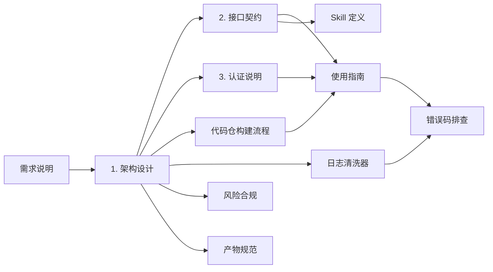

# AGENTS.md — CodeArtsBuild Skill 仓库代理指南

> 本文件面向在本仓库工作的 AI 代理/协作者：说明工程上下文、目录约定与工作规约。**代理修改本仓库前必读**。

## 工程上下文

- **语言**：TypeScript（strict + ESM）
- **运行时**：Node.js
- **形态**：dsh 插件（bundle）；云侧调用底层经 KooCLI（`hcloud`）承载（例外：`list_artifacts` 的 `ShowNewOutput` 需手动 HTTP 调用）

## 目录约定

| 路径 | 职责 |
|------|------|
| `skills/codeartsbuild/SKILL.md` | Skill 定义（工具清单/强制规约/建议操作路径），**LLM 编排依据** |
| `docs/api-contract.md` | 工具接口契约，**工具的唯一事实来源**，实现必须与之一致 |
| `docs/architecture.md` | 架构设计（v0.6） |
| `docs/repo-analyzer.md` | 本地构建流程（`repo_build` 规约） |
| `docs/log-cleaner.md` | 日志清洗规范 |
| `src/` | 插件实现；工具经 `ctx.tools.register(defineTool(...))` 注册 |
| `README.md` | 面向用户的项目入口（安装/使用/文档索引），**不含代理规约** |

## 工作规约

1. **文档先行**：所有实现以 `docs/architecture.md` 为准，代码与文档不一致视为缺陷。
2. **契约驱动**：`docs/api-contract.md` 是工具的唯一事实来源，先定契约再实现；改工具须同步更新契约。
3. **实测对齐**：华为云操作名/参数以 KooCLI 实测为准；未实测的标注"待确认"，不得臆造参数。
4. **v3 禁用**：CodeArtsBuild `/v3/...` 旧版接口一律禁用；仅用 v1/v4 推荐接口（白名单见 api-contract §1.4.3）。
5. **最小文档集**：不写空话，每个文档必须有可执行、可验证的内容。

## 核心主键（数据来源强制关系）

| 主键 | 获取方式 | 需要它的工具 |
|------|----------|--------------|
| `project_id` | 用户手动填写（TODO：项目管理/维护拓展） | `create_job` / `list_records` |
| `job_id` | `create_job` 返回；或 `list_jobs` 按名称（`search`）搜索 | `get_job` / `update_job` / `delete_job` / `run_job` / `stop_job` / `get_status` |
| `build_no` | `run_job` 生成（每次构建独立，同 job 内递增） | `stop_job` / `wait_build` / `get_record` / `list_artifacts` / `get_status` |
| `record_id` | `get_record(jobId, buildNo)`（唯一来源） | `get_log` |

依赖链：`project_id →(用户填写) create_job → job_id → run_job → build_no → get_record → record_id → get_log`

## 文档间关系

## 待办事项

| # | 事项 | 状态 |
|---|------|------|
| 1 | 接口契约待人工确认项：record_id 对应关系、ShowNewOutput 字段、ExecuteJob 分支约定、get_status 替换接口 | ⏳ 待确认 |
| 2 | 按序编写：`usage.md` → `errors.md` → `prd.md` → `artifacts.md` → `risk-compliance.md` → `changelog.md` | ⏳ 待办 |
| 3 | projectId 项目管理/维护（自动选择、缓存、权限校验） | ⏳ 待办 |
| 4 | **架构缺口（完备性评估 2026-09-17，P0）**：`wait_build` 轮询参数（间隔/退避/最大超时阈值、超时后行为）未定义，需在架构 §4.5/契约 §2.14 补齐 | ⏳ 待办 |
| 5 | **架构缺口（P0）**：`repo_build` 的 `recommendedSteps` → `create_job.steps` 映射契约缺失（module_id/name 必填），需约束输出格式与 create_job 入参同构 | ⏳ 待办 |
| 6 | **架构缺口（P1）**：G2 修复闭环时序（建议→修复→重试→再诊断，上限 3 轮）未在架构建模，需补 §6.3 | ⏳ 待办 |
| 7 | **架构缺口（P1）**：projectId 会话级传递机制（一次填写、`create_job`/`list_records` 复用）未设计 | ⏳ 待办 |
| 8 | **架构缺口（P2）**：`get_status` 替换接口决策后，同步更新架构 §4.8 标注（与 #1 联动） | ⏳ 待办 |
| 9 | **架构缺口（P2）**：`local-build`/`repo_build` 分包定位（现归 infra/，属场景 B 核心能力，评审是否上移） | ⏳ 待办 |
| 10 | **架构缺口（P3，M2+）**：list_* 缓存策略、多会话并发隔离（run_job/wait_build/stop_job）、契约一致性测试（实现 vs api-contract）、KooCLI 版本兼容、配置优先级（env vs cordis config） | ⏳ 待办 |
