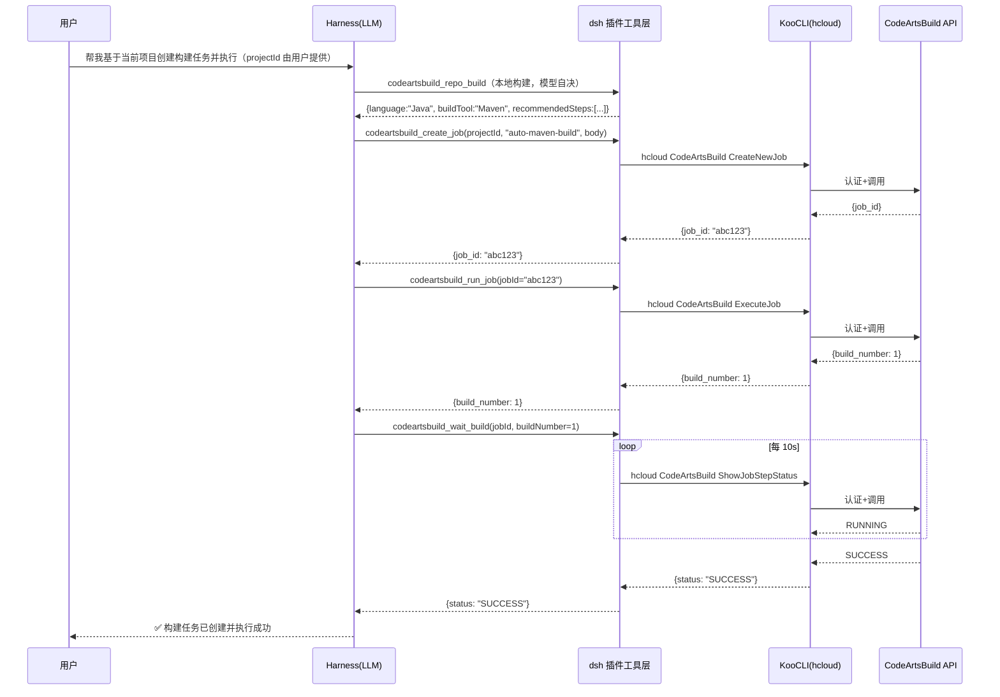

# CodeArtsBuild 构建插件 — 架构设计文档

> **文档编号**: CAB-ARCH-001  
> **版本**: v0.7.0（契约同步 api-contract v0.4.3）  
> **日期**: 2026-09-17  
> **状态**: 待评审  
> **变更**: v0.6→v0.7 — 契约同步：核心域接口签名与工具摘要对齐（list_records→projectId、get_record/list_artifacts→buildNo、get_log 仅 recordId、get_status buildNo 必填）；KooCLI 操作映射更新（ShowJobBuildRecordDetail / ShowNewOutput / ListOfficialTemplate / DownloadBuildFullLog）；目录树补 repo-analyzer.ts；时序图去掉 list_projects；待确认项状态更新

## 修订记录

| 版本 | 日期 | 说明 |
|------|------|------|
| v0.1.0 | 2026-09-15 | 初始架构草案（纯 MCP Server 方案） |
| v0.2.0 | 2026-09-15 | 重构：业务抽象层 + Harness 插件为主 + 代码仓感知 + 日志分析 |
| v0.3.0 | 2026-09-15 | 评审修订：全部华为云 API 调用（含 Token）改用 KooCLI；产物双链接；代码仓路由；日志按需获取 |
| v0.4.0 | 2026-09-16 | **DeepSeek Harness 主导**：技术选型以 dsh 插件（`@deepseek-ai/dsh`）为主，主入口为 dsh；KooCLI 实测操作列表；状态枚举去除 INITIALIZING/ABORTED |
| v0.5.0 | 2026-09-16 | **接口版本体系**：v3 旧版禁用、v1/v4 新接口优先；核心操作表/禁用清单/待确认项按 Path 实测对齐 |
| v0.6.0 | 2026-09-16 | **专注 dsh**：移除 MCP 辅助形态；src 按模块分包（给出拆分依据）；projectId 运行时定义；代码仓分析/日志清洗细节迁移至 `repo-analyzer.md` / `log-cleaner.md` |
| v0.7.0 | 2026-09-17 | **契约同步（api-contract v0.4.3）**：核心域接口签名与工具摘要对齐；KooCLI 操作映射更新（`ShowJobBuildRecordDetail` / `ShowNewOutput` / `ListOfficialTemplate` / `DownloadBuildFullLog`）；目录树补 `repo-analyzer.ts`；时序图去掉 `list_projects`；待确认项状态更新 |

---

## 1. 背景与目标

### 1.1 背景

Huawei Cloud **CodeArts Build（编译构建）** 是云上编译构建平台，支持 Maven / Gradle / Npm / Docker 等构建场景。开发者使用 **DeepSeek Harness（dsh）** 作为 AI 编码助手——dsh 以「一切皆插件」为核心设计，模型、工具、技能、会话、沙箱等所有 Agent 能力均由插件组合而成，可自由替换和灵活重组。但当前缺少与构建系统的集成能力。

当前痛点：
- 每次创建构建任务需手动在控制台操作，无法基于当前代码仓自动推断配置
- 构建失败后需人工登录控制台、翻找日志、定位原因
- 无自然语言入口，无法「一句话完成创建+执行+获取产物」
- dsh 生态缺少 CodeArtsBuild 插件，无法充分利用 Harness 的工具注册/技能/会话能力

### 1.2 目标

| 编号 | 目标 | 验收标准 |
|------|------|----------|
| G1 | 自动创建并执行构建 | 基于给定的项目，自动分析当前代码仓技术栈，创建构建任务并**执行成功** |
| G2 | 异常自动诊断 | 构建失败时自动**拉取日志**，清洗建模后交 LLM **分析根因**，给出可操作建议 |
| G3 | 获取构建产物 | 列出产物清单，提供**下载链接**与**页面查询链接** |
| G4 | 构建状态监控 | 轮询等待构建进入终态 |
| G5 | 业务抽象 | 抽象构建生命周期核心域，以 **DeepSeek Harness 插件**（bundle）承载，专注 dsh 生态 |

### 1.3 非目标（本期不做）

- 不做构建任务图形化编排界面
- 不做构建机（Slave）管理
- 不做 IAM 账号/权限管理
- 不做非 CodeArtsBuild 的 Provider 实现（但架构预留扩展点）

### 1.4 术语表

| 术语 | 说明 |
|------|------|
| dsh / DeepSeek Harness | DeepSeek AI 的 Agent 运行时，`@deepseek-ai/dsh`；一切皆插件 |
| dsh 插件（bundle） | dsh 插件包：`apply(ctx)` 注册工具/命令/服务，含 `dsh.bundle` 声明与 `cordis.patch.yml` |
| cordis.yml | dsh profile 的插件实例声明文件（每实例一条插件配置） |
| Build Provider | 构建后端抽象（CodeArtsBuild 是第一个实现） |
| Build Job | 构建任务 |
| Build Record | 一次构建执行记录（build_no） |
| Artifact | 构建产物 |

---

## 2. 需求分析

### 2.1 用户故事

| ID | 角色 | 故事 | 优先级 |
|----|------|------|--------|
| US-1 | 开发者 | 作为开发者，我希望列出我可见的 CodeArts 项目 | P0 |
| US-2 | 开发者 | 作为开发者，我希望按项目列出所有构建任务及最近状态 | P0 |
| US-3 | 开发者 | 作为开发者，我希望查看某个构建任务的完整配置 | P1 |
| US-4 | 开发者 | **作为开发者，我希望基于当前代码仓自动创建构建任务并执行成功** | P0 |
| US-5 | 开发者 | 作为开发者，我希望修改已存在的构建任务配置 | P2 |
| US-6 | 开发者 | 作为开发者，我希望删除废弃的构建任务 | P2 |
| US-7 | 开发者 | 作为开发者，我希望触发构建任务执行并指定分支/参数 | P0 |
| US-8 | 开发者 | 作为开发者，我希望停止误触发的构建 | P1 |
| US-9 | 开发者 | 作为开发者，我希望查询构建状态并等待其完成 | P0 |
| US-10 | 开发者 | 作为开发者，我希望查看构建历史记录 | P1 |
| US-11 | 开发者 | 作为开发者，我希望获取构建产物的清单、下载链接与页面查询链接 | P0 |
| US-12 | 开发者 | 作为开发者，我希望看到可用的构建步骤模板 | P1 |
| US-13 | 开发者 | **作为开发者，构建失败时我希望自动获取日志并分析失败原因** | P0 |
| US-14 | 开发者 | 作为开发者，我希望自动检测当前代码仓的技术栈（Maven/Npm/Gradle 等） | P0 |

### 2.2 业务场景抽象

功能需求映射不仅限于 CodeArtsBuild 具体接口，而是抽象为**构建生命周期业务场景**：

```
构建生命周期 (Build Lifecycle)
├── 场景 A: 项目感知       — 发现项目、任务列表
├── 场景 B: 代码仓分析     — 本地技术栈检测、构建配置推荐
├── 场景 C: 任务编排       — 创建/更新/删除构建任务
├── 场景 D: 执行控制       — 触发/停止/轮询
├── 场景 E: 状态监控       — 状态查询、历史记录
├── 场景 F: 产物管理       — 产物清单、下载
└── 场景 G: 故障诊断       — 日志拉取、清洗建模、AI 分析
```

每个场景由**核心域接口**定义，CodeArtsBuild 作为 Provider 实现这些接口。未来可接入其他构建后端（Jenkins / GitHub Actions / GitLab CI）。

### 2.3 非功能需求

| 类别 | 需求 | 指标 |
|------|------|------|
| 安全 | 凭据不外泄 | AK/SK 由 KooCLI 管理，插件不接触；不出现在工具结果中 |
| 安全 | Token 管理 | 由 KooCLI 自动获取/刷新，插件不自行实现 |
| 可靠 | 网络失败重试 | 幂等命令支持重试，限 3 次 |
| 性能 | 列表接口分页 | 默认 20 条/页，上限 100 |
| 性能 | 大日志管控 | 日志仅 error 分析时获取，按需截断 |
| 可扩展 | Provider 可插拔 | 新增 Provider 不改动适配层与 Skill 层 |
| 可观测 | 日志输出 | 统一走 stderr（不污染 stdio 协议） |

---

## 3. 总体架构

### 3.1 分层架构

```mermaid
flowchart TB
    subgraph TerminalLayer["终端层（dsh）"]
        DSH[dsh 插件<br/>apply(ctx) + defineTool 注册原生工具]
    end

    subgraph CoreDomain["核心业务域（与后端无关）"]
        direction LR
        S1[场景 A: 项目感知]
        S2[场景 B: 代码仓分析]
        S3[场景 C: 任务编排]
        S4[场景 D: 执行控制]
        S5[场景 E: 状态监控]
        S6[场景 F: 产物管理]
        S7[场景 G: 故障诊断]
    end

    subgraph ProviderLayer["Provider 层（可插拔）"]
        direction LR
        CAB[CodeArtsBuild Provider]
        FUT[...其他 Provider<br/>Jenkins / GHA<br/>预留]
    end

    subgraph Infra["基础设施层"]
        KOO[KooCLI 适配器<br/>hcloud 命令构造/执行/解析<br/>含 Token 获取]
        LOG[日志清洗器<br/>详见 log-cleaner.md]
        REPO[代码仓分析器<br/>详见 repo-analyzer.md]
    end

    subgraph Cloud["Huawei Cloud"]
        IAMAPI[IAM API]
        CABAPI[CodeArtsBuild API]
    end

    DSH --> CoreDomain
    CoreDomain --> ProviderLayer
    CAB --> KOO
    CAB --> LOG
    CAB --> REPO
    KOO --> IAMAPI
    KOO --> CABAPI
```

### 3.2 设计原则

| 原则 | 说明 |
|------|------|
| **业务抽象优先** | 核心域定义构建生命周期场景接口，不绑定任何具体后端 |
| **DeepSeek Harness 专注** | 以 **dsh 插件**（bundle）为唯一终端形态，高度结合 Harness 能力：`ctx.tools.register(defineTool(...))` 注册原生工具、cordis 依赖注入、skill 机制、会话能力；**本期不做 MCP 辅助形态** |
| **Provider 可插拔** | CodeArtsBuild 是第一个 Provider，新增后端仅需实现 Provider 接口 |
| **本地代码仓感知** | 分析本地工作区文件自动推断技术栈和构建配置（详见 `repo-analyzer.md`） |
| **日志清洗→LLM 分析** | 插件负责拉取日志并结构化建模，根因分析交给 LLM（详见 `log-cleaner.md`） |
| **KooCLI 统一承载** | 所有华为云 OpenAPI 调用（含 Token）经 KooCLI，插件不接触凭据 |

### 3.3 技术选型

| 项 | 选型 | 理由 |
|----|------|------|
| 语言 | TypeScript / Node.js 20+ | dsh 官方要求 Node 22.19+，TS 为 dsh 插件标准语言 |
| **Harness 插件** | **`@deepseek-ai/dsh` 插件（bundle）体系** | **唯一终端形态：`apply(ctx)` + `ctx.tools.register(defineTool(...))` + `cordis.patch.yml`，深度结合 dsh 的工具/技能/会话能力** |
| 工具 schema | `@deepseek-ai/schemastery` | dsh 标准 schema 库（z），与 defineTool 原生兼容 |
| 参数校验 | `@deepseek-ai/schemastery` | 与 dsh 工具注册一体化，避免 Zod 双轨 |
| **华为云调用** | **KooCLI（`hcloud`）v7.2.12** | **统一承载 CodeArtsBuild 及所有华为云 OpenAPI 调用，含 Token 获取；操作列表已实测（见 §4.8）** |

---

## 4. 模块设计

### 4.1 目录结构

```
dsh-codeartsbuild/                      # dsh 插件（bundle），唯一终端形态
├── package.json                        # 含 dsh.bundle.patch 声明（bundle 元数据）
├── cordis.patch.yml                    # 插件配置层（默认配置）
├── lib/                                # 编译产物（dsh 加载入口）
│   ├── index.js                        # apply(ctx) 注册工具
│   └── client.js                       # （可选）浏览器半侧入口
├── src/                                # TypeScript 源码（按模块分包，见下）
│   ├── entry/                          # 插件入口
│   │   └── index.ts                    # apply(ctx) + defineTool 注册
│   ├── tools/                          # 工具定义层
│   │   ├── index.ts                    # 工具注册聚合
│   │   └── schemas.ts                  # 各工具输入 schema（schemastery）
│   ├── core/                           # 核心业务域（与后端无关）
│   │   ├── provider.ts                 # BuildProvider 接口定义
│   │   ├── types.ts                    # 共享类型（Project/Job/Record/Artifact/Log）
│   │   └── lifecycle.ts                # 场景编排（调用链组合、wait_build 轮询）
│   ├── providers/                      # Provider 实现层（可插拔）
│   │   ├── codeartsbuild/              # CodeArtsBuild Provider
│   │   │   ├── index.ts                # Provider 实现（场景 A~G）
│   │   │   ├── client.ts               # 业务客户端（基于 KooCLI 调用）
│   │   │   └── operation-map.ts        # 工具→KooCLI 操作映射（v1/v4 白名单）
│   │   └── index.ts                    # Provider 注册表（工厂）
│   ├── infra/                          # 基础设施层
│   │   ├── koo-cli.ts                  # KooCLI 适配器（命令执行与输出解析）
│   │   ├── repo-analyzer.ts            # 代码仓分析器（详情见 repo-analyzer.md）
│   │   ├── log-cleaner.ts              # 日志清洗器（详情见 log-cleaner.md）
│   │   └── local-build/                # 本地构建域实现（不经 KooCLI）
│   │       ├── index.ts                # 聚合导出 repo_build
│   │       ├── probe.ts                # 内部：仓库类型探测（fs 检测配置文件）
│   │       ├── guidance.ts             # 内部：按仓库类型生成编译指导
│   │       ├── build.ts                # 2.16 repo_build（child_process 执行 + 异常分类）
│   │       ├── artifact.ts             # 内部：产物收集（glob 扫描）
│   │       └── archive.ts              # 内部：过程留档（写 build-records/）
│   └── index.ts                        # 模块出口（聚合导出）
│
└── docs/
    ├── architecture.md                 # 本文件
    ├── api-contract.md                 # 工具接口契约
    ├── auth.md                         # KooCLI 认证说明
    ├── repo-analyzer.md                # 代码仓分析器详细设计
    ├── log-cleaner.md                  # 日志清洗器详细设计
    └── usage.md                        # 使用指南（待写）
```

#### 4.1.1 src 分包拆分依据

src 按**职责边界**分为 5 个包，拆分依据如下（供评审选择/调整）：

| 包 | 内容 | 拆分依据 |
|----|------|----------|
| `entry/` | 插件入口 | **dsh 装配边界**：`apply(ctx)` 是 dsh 加载的唯一入口，独立成包使入口最小化，避免入口依赖具体业务实现 |
| `tools/` | 工具定义 | **契约边界**：工具名称/描述/schema 是面向 LLM 的契约，与实现解耦；schema 变更不影响 Provider，便于对照 `api-contract.md` 评审 |
| `core/` | 核心业务域 | **抽象边界**：`BuildProvider` 接口与生命周期编排与具体后端无关，是"业务抽象优先"原则的落点 |
| `providers/` | Provider 实现 | **扩展边界**：新增后端（Jenkins/GHA）只需新增一个子包实现 `BuildProvider`，不改动 core/tools/infra |
| `infra/` | 基础设施 | **技术边界**：KooCLI 调用、文件扫描、日志处理是可复用基础设施，与业务场景解耦，独立便于替换（如 KooCLI 换 SDK） |

**备选拆分依据**（如评审倾向其他维度，可替换上述方案）：

1. **按业务场景分包**：`projects/`（场景A）、`jobs/`（场景C/D/E）、`artifacts/`（场景F）、`diagnose/`（场景G）——场景内聚强，但 Provider 横跨多包，扩展性差。
2. **按技术层分包**：`api/`、`domain/`、`infra/` 三层——与当前方案同构，只是 `entry/tools` 合并进 `api` 层，粒度更粗。
3. **保持扁平**（不分包）：适合小型插件；但本项目有 16+ 工具、Provider 抽象、基础设施三类职责，扁平会导致单文件过大。

> 推荐**方案 1（按职责边界）**：扩展性最好，与「Provider 可插拔」「业务抽象优先」两条设计原则对齐。

> ⚠️ **源码状态说明**：早期 MCP 方案遗留 `src/`（auth.ts / client.ts / index.ts / tools.ts / types.ts）已于 2026-09-17 删除（与本架构 dsh 插件形态不匹配）。编码阶段须按本目录结构从零搭建。

### 4.2 dsh 插件（bundle）清单

`package.json` 关键字段：

```json
{
  "name": "@dsh-codearts/codeartsbuild",
  "version": "1.0.0",
  "type": "module",
  "main": "lib/index.js",
  "dsh": {
    "bundle": {
      "patch": "./cordis.patch.yml"
    }
  },
  "exports": {
    ".": "./lib/index.js",
    "./cordis.patch.yml": "./cordis.patch.yml"
  }
}
```

### 4.3 接入 dsh profile

用户 profile 中声明插件实例（`cordis.yml` / `dsh plugin add`）：

```yaml
# cordis.patch.yml 或 profile 装配
plugins:
  - id: codeartsbuild
    name: '@dsh-codearts/codeartsbuild'
    config:
      region: cn-north-4
      # 不固定 projectId —— 由用户在运行时手动填写
```

**projectId 运行时定义**：
- 插件配置**不强制** `projectId`（`CODEARTS_BUILD_PROJECT_ID` 仅为可选默认值）
- 典型流程：`projectId` 由用户手动填写 → 作为 `create_job` / `list_records` 入参；`list_projects` 仅作查看辅助
- 好处：多项目用户无需改配置；LLM 可在会话中自由切换项目

### 4.5 核心域接口（Provider 抽象）

```typescript
/** 构建生命周期 Provider 接口 - 与具体后端解耦 */
interface BuildProvider {
  // 场景 A: 项目感知
  listProjects(): Promise<ProjectInfo[]>;
  listBuildJobs(projectId: string, page?: number, pageSize?: number): Promise<BuildJobInfo[]>;
  getBuildJob(jobId: string): Promise<BuildJobDetail>;

  // 场景 C: 任务编排
  createBuildJob(projectId: string, jobName: string, config: BuildJobConfig): Promise<CreateJobResult>;
  updateBuildJob(jobId: string, config: Partial<BuildJobConfig>): Promise<void>;
  deleteBuildJob(jobId: string): Promise<void>;

  // 场景 D: 执行控制
  runBuildJob(jobId: string, params?: BuildParameter[], scm?: ScmInfo): Promise<RunBuildResult>;
  stopBuildJob(jobId: string, buildNumber: number): Promise<void>;

  // 场景 E: 状态监控
  getBuildStatus(jobId: string, buildNumber: number): Promise<BuildStatusInfo>;
  listBuildHistory(projectId: string, opts?: HistoryQueryOpts): Promise<{ records: BuildHistoryRecord[]; total: number }>;
  getBuildHistoryDetail(jobId: string, buildNumber: number): Promise<BuildHistoryDetail>;  // 返回含 build_record_id（record_id 唯一来源）
  waitForBuild(jobId: string, buildNumber: number, opts?: WaitOpts): Promise<BuildStatusInfo>;

  // 场景 F: 产物管理 —— 每个产物同时给出下载链接与页面查询链接
  listBuildArtifacts(jobId: string, buildNumber: number): Promise<BuildArtifact[]>;

  // 场景 G: 故障诊断 —— 日志仅在 error 分析时通过 download 接口获取
  getBuildLog(recordId: string): Promise<BuildLog>;
  listBuildTemplates(): Promise<BuildTemplate[]>;
}

/** 产物模型：双链接 */
interface BuildArtifact {
  name: string;
  type?: string;
  size?: number;
  downloadUrl: string;        // 直接下载链接（API 返回，带鉴权）
  consoleUrl: string;         // 页面查询链接（控制台 Web 页面，可分享/浏览器打开）
  uri?: string;               // 制品仓库 URI
  version?: string;           // 产物版本
}

/** 日志结构化模型 */
interface BuildLog {
  raw: string;                    // 原始日志（download 接口下载）
  truncated: boolean;            // 是否因体积过大被截断
  byteSize: number;              // 原始日志字节数
  structured: LogSegment[];       // 清洗后的结构化段
  errorSummary?: LogError;       // 提取的错误摘要
}

interface LogSegment {
  phase: 'checkout' | 'build' | 'test' | 'package' | 'deploy' | 'unknown';
  level: 'info' | 'warn' | 'error';
  content: string;
  lineRange: [number, number];
}

interface LogError {
  phase: LogSegment['phase'];
  errorType: string;             // 编译错误/依赖缺失/测试失败/超时/OOM 等
  message: string;
  line?: number;
  context?: string;              // 前后几行上下文
}
```

### 4.6 代码仓分析器

本地工作区扫描，**检测关键文件识别技术栈，再按语言路由到不同的编译方案**。

- **职责**：输入仓库路径 → 输出语言/构建工具/推荐模板/编译路由/推荐步骤
- **实现**：`src/infra/repo-analyzer.ts`
- **详细设计**（检测规则表、优先级、Monorepo 处理、边界情况）：见 `docs/repo-analyzer.md`

### 4.7 日志清洗器

原始构建日志 → 结构化模型（分段、分级、错误分类、截断），支撑 LLM 根因分析。

- **职责**：输入原始日志 → 输出 `BuildLog` 结构化模型（见 §4.5）+ 错误摘要
- **获取时机约束**：日志**仅在 error 分析场景**（构建失败 / 用户显式要求）时通过 download 接口获取；大日志按需截断（标记 `truncated`/`byteSize`）；正常状态查询不拉取
- **实现**：`src/infra/log-cleaner.ts`
- **详细设计**（处理流水线、三区采样、错误分类表、脱敏）：见 `docs/log-cleaner.md`

清洗后的结构化日志交给 LLM 做根因分析，Skill 指令引导 LLM：
> "以下是清洗后的构建日志摘要，请分析失败根因并给出修复建议："

### 4.8 KooCLI 实测操作列表（2026-09-16 实测）

> 环境：KooCLI v7.2.12，`hcloud CodeArtsBuild --help` 实测。服务名 `CodeArtsBuild`。

**与构建生命周期相关的核心操作**（已实测参数；⭐ = 推荐接口 v1/v4，其余为 v3 旧版禁用）：

| 场景 | KooCLI 操作 | 版本 | Method | 关键参数（必填加粗） |
|------|-------------|------|--------|----------------------|
| 项目感知 | ⭐ `ShowRelatedProject` | v1 | GET | 无（仅 --cli-region） |
| 任务列表 | ⭐ `ListJob` | v1 | GET | page_index?, page_size?, search?, build_status? |
| 项目任务列表 | ⭐ `ListProjectJobs` | v1 | GET | **project_id** |
| 任务详情 | ⭐ `ShowJobConfig` | v1 | GET | **job_id** |
| 创建任务 | ⭐ `CreateNewJob` | v1 | POST | **arch**, **job_name**, **project_id**, **steps.[N].module_id**, **steps.[N].name**, scms.[N].*, parameters.[N].* |
| 更新任务 | ⭐ `UpdateNewJob` | v1 | POST | **job_id**, 与 create 同构 |
| 删除任务 | ⭐ `DeleteTheJob` | v1 | POST | **job_id**（path） |
| 执行构建 | ⭐ `ExecuteJob` | v1 | POST | **job_id**, parameter.[N].{name,value}?, scm.{build_commit_id, build_tag}? |
| 停止构建 | ⭐ `StopTheJob` | v1 | POST | **job_id**（path） |
| 运行状态 | ⭐ `ShowJobStepStatus` | v1 | GET | **job_id**（path） |
| 是否在构建 | ⭐ `ShowRunningStatus` | v1 | GET | **job_id** |
| 历史列表 | ⭐ `ListRecords` | v1 | GET | **build_project_id**, limit?, offset? |
| 记录详情 | ⭐ `ShowJobBuildRecordDetail` | v1 | GET | **job_id**, **build_no** |
| 简要信息 | ⭐ `ListBriefRecord` | v1 | POST | **limit**, body=job_id 数组 |
| 构建产物 | ⭐ `ShowNewOutput` | v1 | GET | **job_id**, **build_no**（KooCLI 未封装，需手动 HTTP 调用） |
| 全量日志 | ⭐ `DownloadBuildFullLog` | v1 | GET | **record_id**, log_level?(INFO\|DEBUG) |
| 实时日志 | ⭐ `DownloadBuildRealTimeLog` | v1 | GET | **job_id**, **build_no** |
| 任务模板 | ⭐ `ListOfficialTemplate` | v1 | GET | name?, page?, page_size? |
| 成功率 | ⭐ `ShowJobBuildSuccessRatio` | v1 | GET | 参数需实测 |

**v3 旧版接口（禁用）**：`CreateBuildJob`、`RunJob`、`UpdateBuildJob`、`DeleteBuildJob`、`StopJob`、`StopBuildJob`、`ListJobConfig`、`ShowJobStatus`、`ShowListHistory`、`ShowLastHistory`、`ShowListPeriodHistory`、`ShowHistoryDetails`、`ShowRecordInfo`、`ShowOutputInfo`、`ShowJobListByProjectId`、`ListBuildInfoRecord`、`ShowJobSuccessRatio`、`DownloadLogByRecordId`、`DownloadRealTimeLog`、`ListNotice`、`ListTemplates`。

> ⚠️ **接口禁用规则（评审决策）**：CodeArtsBuild **v3 为旧版接口（禁用）**，**v1/v4 为新接口（优先使用）**。判定依据为 KooCLI 服务定义中的 `Request.Path`（如 `ExecuteJob`→`/v1/job/execute`、`RunJob`→`/v3/jobs/build`）。完整禁用清单与推荐白名单见 `docs/api-contract.md` §1.4。

### 4.9 CodeArtsBuild 完整操作列表（实测归档）

**完整操作列表已归档**：`docs/koocli-codeartsbuild-ops.txt`（2026-09-16，KooCLI v7.2.12 实测，136 行 / 约 130 个操作，已去除 ANSI 颜色码）。

操作清单按功能域分类：

| 功能域 | 操作 |
|--------|------|
| **项目感知** | `ShowRelatedProject`、`ListRelatedProjectInfo`、`ShowProjectPermission`、`ShowDefaultProjectPermission`、`ApplyProjectPermission`、`ShowProjectJobPermission` |
| **任务 CRUD** | `CreateNewJob`、`CreateBuildJob`、`UpdateNewJob`、`UpdateBuildJob`、`DeleteBuildJob`、`DeleteTheJob`、`CopyJob`、`BatchDeleteBuildJobs`、`ListJob`、`ListProjectJobs`、`ListJobConfig`、`ShowJobConfig`、`ShowJobConfigDiff`、`ShowJobInfo`、`ShowJobListByProjectId`、`ShowJobTotal`、`ShowCopyName` |
| **执行控制** | `ExecuteJob`、`RunJob`、`StopBuildJob`、`StopJob`、`StopTheJob`、`ShowJobStatus`、`ShowRunningStatus`、`ShowJobStepStatus`、`ShowBuildDetails` |
| **状态/历史** | `ShowListHistory`、`ShowListPeriodHistory`、`ShowLastHistory`、`ShowRecordDetail`、`ShowRecordInfo`、`ShowHistoryDetails`、`ShowBuildRecord`、`ListRecords`、`ListBriefRecord`、`ListBuildInfoRecord`、`ListBuildInfoRecordByJobId`、`ListRecords`、`ShowJobBuildRecordDetail`、`ShowJobBuildSuccessRatio`、`ShowJobSuccessRatio`、`ShowJobBuildTime` |
| **产物/日志** | `ShowOutputInfo`、`DownloadBuildLog`、`DownloadBuildFullLog`、`DownloadBuildRealTimeLog`、`DownloadRealTimeLog`、`DownloadTaskLog`、`DownloadLogByRecordId`、`ShowBuildRecordBuildScript`、`ShowBuildRecordFlowGraph`、`ShowBuildRecordFullStages`、`ShowFlowGraph` |
| **模板** | `ListCustomTemplate`、`ListOfficialTemplate`、`ListRecommendOfficialTemplate`、`ListTemplates`、`ShowTemplate`、`ShowYamlTemplate`、`ShowDockerfileTemplate`、`ShowImageTemplateList`、`CreateTemplate`、`CreateTemplates`、`UpdateBuildJob`、`DeleteTemplate`、`DeleteTemplates`、`AddFavouriteCustomTemplate`、`AddFavouriteOfficialTemplate`、`RemoverFavouriteCustomTemplate`、`RemoverFavouriteOfficialTemplate`、`SaveTemplateUsedInfo` |
| **参数/密钥** | `ListBuildParameter`、`ShowBuildParamsList`、`ShowDefaultBuildParameters`、`ShowJobSystemParameters`、`UploadKeystore`、`DownloadKeystore`、`DownloadKeystoreByName`、`ListKeystore`、`ListKeystoreSearch`、`UpdateKeystore`、`DeleteKeystore`、`AddKeystorePermission`、`UpdateKeystorePermission`、`DeleteKeystorePermission`、`ShowKeystorePermission` |
| **通知/权限/其他** | `ShowJobNoticeConfigInfo`、`ListNotice`、`UpdateNotice`、`UpdateNewNoticeNew`、`DisableNotice`、`ShowJobRolePermission`、`ShowJobPipelineInfo`、`ShowDomainStatus`、`ShowDomainsStatuses`、`ShowUserChargeType`、`ShowUserOverPackageQuota`、`CheckJobNameIsExists`、`CheckJobInternal`、`CheckJobCountIsTopLimit`、`CheckWebhookUrl`、`ClearRecyclingJobs`、`ListRecyclingJob`、`RestoreRecyclingJobs`、`DeleteRecyclingJobs`、`SetKeepTime`、`ShowActionIInfo`、`ShowAvailableInnerSpec`、`ShowReportSummary`、`ShowSummaryBuildJobInfo`、`ShowPackageSpecCountDown`、`ListEndPoints`、`ListGroupTree`、`CreateJobGroup`、`UpdateJobGroup`、`DeleteGroup`、`MoveGroup`、`BatchUpdateJobRolePermission`、`ListJunitCoverageSummary`、`DownloadJunitCoverageZip`、`ShowDisable`、`DisableBuildJob`、`EnableBuildJob`、`DisableTheJob`、`SwitchedPacket`、`ListUpdateJobHistory`、`ListRepository`、`ListRepoBranch` |

> 该文件是 KooCLI 实测原始归档，后续如需更新（KooCLI 升级后），重跑：
> `hcloud CodeArtsBuild --help | sed 's/\x1b\[[0-9;]*m//g' > docs/koocli-codeartsbuild-ops.txt`

---

## 5. 工具契约（摘要）

完整契约见 `docs/api-contract.md`（待按 KooCLI 实测人工确认）。工具全景：

| # | 工具 | 输入（**必填**） | 输出要点 |
|---|------|------------------|----------|
| 1 | `codeartsbuild_list_projects` | — | 项目列表 |
| 2 | `codeartsbuild_list_jobs` | search?, pageIndex?, pageSize? | 任务列表（全局搜索） |
| 3 | `codeartsbuild_get_job` | **jobId** | 任务详情 |
| 4 | `codeartsbuild_create_job` | **projectId**, **jobName**, **arch**, **steps**, scms? | `{job_id}` |
| 5 | `codeartsbuild_update_job` | **jobId**, **body** | `{updated: true}` |
| 6 | `codeartsbuild_delete_job` | **jobId** | `{deleted: true}` |
| 7 | `codeartsbuild_run_job` | **jobId**, parameters?, scm? | `{build_no}` |
| 8 | `codeartsbuild_stop_job` | **jobId**, **buildNo** | `{stopped: true}` |
| 9 | `codeartsbuild_get_status` | **jobId**, **buildNo** | 状态信息 |
| 10 | `codeartsbuild_list_records` | **projectId**, limit?, offset? | 历史记录 |
| 11 | `codeartsbuild_get_record` | **jobId**, **buildNo** | 记录详情（含 `record_id`，失败定位） |
| 12 | `codeartsbuild_list_artifacts` | **jobId**, **buildNo** | 产物清单（**下载链接 + 页面查询链接**） |
| 13 | `codeartsbuild_list_templates` | — | 模板列表 |
| 14 | `codeartsbuild_wait_build` | **jobId**, **buildNumber** | 终态结果 |
| 15 | `codeartsbuild_get_log` | **recordId** | **清洗后结构化日志（仅 error 分析时调用）** |
| 16 | `codeartsbuild_repo_build` | repoPath, repoType?, buildCommandHint? | 本地构建（编译指导+执行+产物+留档，模型自决） |

> 工具 12 在 v0.3 起同时返回下载链接与页面查询链接。
> 工具 15-16 为本地构建/日志诊断能力（v0.4 命名规约统一）。

---

## 6. 关键流程时序

### 6.1 G1 验收：基于当前代码仓自动创建并执行构建



### 6.2 G2 验收：构建失败自动诊断

```mermaid
sequenceDiagram
    participant U as 用户
    participant H as Harness(LLM)
    participant P as dsh 插件工具层
    participant K as KooCLI(hcloud)
    participant API as CodeArtsBuild API

    Note over H: wait_build 返回 status=FAILED
    H->>P: codeartsbuild_get_log(recordId)  ← 仅 error 分析时获取
    P->>K: hcloud CodeArtsBuild DownloadBuildFullLog（download 接口）
    K->>API: 认证+调用
    API-->>K: 原始日志文本
    K-->>P: 原始日志（若过大则截断，标记 truncated/byteSize）
    P-->>H: 原始日志文本
    H->>P: 日志清洗（log-cleaner.ts，详见 log-cleaner.md）
    P-->>H: {structured: [...], errorSummary: {phase:"build", errorType:"编译错误", line:42, context:"..."}}
    H->>H: LLM 分析结构化日志
    Note over H: 根因: pom.xml 缺少依赖 X<br/>建议: 添加 &lt;dependency&gt; X
    H-->>U: ❌ 构建失败<br/>根因: 第42行编译错误，缺少依赖 X<br/>建议: 在 pom.xml 添加该依赖<br/>详情: [日志页面链接]
```

### 6.3 异常处理：KooCLI 未配置

```
插件加载/首次调用 → 检查 KooCLI 可用性
  → hcloud 命令不存在 → 报错 + 提示安装 KooCLI（hcloud）
  → 未配置 AK/SK（hcloud configure 未完成）→ 报错 + 提示执行 hcloud configure set
```

---

## 7. 错误处理设计

### 7.1 错误分类

| 类别 | 示例 | 处理方式 |
|------|------|----------|
| 配置错误 | KooCLI 未安装、AK/SK 未配置 | 启动即失败，明确提示安装/配置 hcloud |
| 认证错误 | 401 / Token 过期 | KooCLI 自动处理 Token；仍失败则提示检查 `hcloud configure` |
| 参数错误 | 必填缺失、类型不符 | Zod 校验，返回字段级错误 |
| 业务错误 | 任务不存在、无权限 | 透传 KooCLI 返回的错误码与描述 |
| 网络错误 | 超时、连接失败 | 幂等命令重试 ≤3 次 |
| 构建失败 | status=FAILED | 自动进入日志分析流程（G2） |
| 超时错误 | wait_build 超时 | 返回当前状态 + 提示继续查询 |

### 7.2 错误返回格式（工具统一）

```json
{
  "content": [{ "type": "text", "text": "错误描述（含 API 状态码与响应体）" }],
  "isError": true
}
```

### 7.3 日志清洗错误分类

> 错误分类详细设计（匹配模式、多错误场景、截断策略）已迁移至 `docs/log-cleaner.md`，此处仅保留分类总览：

| errorType | 匹配模式 | 典型场景 |
|-----------|----------|----------|
| `COMPILE_ERROR` | `ERROR.*cannot find symbol` / `COMPILATION ERROR` | Java 编译失败 |
| `DEPENDENCY_MISSING` | `Could not resolve` / `dependency not found` | Maven/Gradle 依赖缺失 |
| `TEST_FAILURE` | `Tests run:.*Failures` / `BUILD FAILURE.*test` | 单元测试失败 |
| `TIMEOUT` | `timeout` / `exceeded` | 构建超时 |
| `OOM` | `OutOfMemoryError` / `killed` | 内存不足 |
| `PERMISSION_DENIED` | `403` / `Forbidden` / `unauthorized` | 权限问题 |
| `UNKNOWN` | 其他 ERROR 级别日志 | 兜底分类 |

---

## 8. 配置与部署

### 8.1 KooCLI 前置依赖

**所有华为云 OpenAPI 调用（含 Token 获取）统一通过 KooCLI（`hcloud`）执行**，插件本身不再直接实现 IAM Token 获取或 HTTP 签名。

```bash
# 1. 安装 KooCLI（一次性）
#    详见 https://support.huaweicloud.com/qs-hcli/hcli_02_001.html
#    Linux/macOS: curl -sSL https://hwcloudcli.obs.cn-north-1.myhuaweicloud.com/cli/latest/hcloud_install.sh | bash
#    Windows: 下载 hcloud_install.bat 执行

# 2. 配置 AK/SK（一次性，KooCLI 负责 Token 获取与刷新）
hcloud configure set --cli-access-key=AK --cli-secret-key=SK --cli-region=cn-north-4
hcloud configure set --cli-project-name=<project_name> --cli-domain-name=<domain_name>

# 3. 验证
hcloud CodeArtsBuild ShowRelatedProject --cli-region=cn-north-4
```

> 插件启动时执行 `hcloud --version` 与 `hcloud configure show` 探测可用性，未就绪则给出上述安装指引。

### 8.2 插件环境变量

| 变量 | 必填 | 说明 |
|------|------|------|
| `CODEARTS_BUILD_REGION` | ✅ | 区域，如 `cn-north-4`（透传给 hcloud `--cli-region`） |
| `CODEARTS_BUILD_PROJECT_ID` | 推荐 | 默认项目 ID，用于 `create_job` 等需要 project_id 的调用 |
| `CODEARTS_CONSOLE_BASE_URL` | ❌ | 控制台基础地址，用于拼装产物页面查询链接 |

> AK/SK 不再由插件读取，统一由 KooCLI 管理（`hcloud configure`）。

### 8.3 dsh 插件安装

插件以 bundle 形式发布到 npm / 私有 registry 后：

```bash
# 在 dsh profile 中安装
dsh plugin --profile <name> add @dsh-codearts/codeartsbuild

# 或在 cordis.yml 声明后启动
dsh web
```

安装流程（dsh 自动完成）：
1. pnpm 将 bundle 写入 profile 依赖
2. CLI 发现 `package.json` 的 `dsh.bundle.patch` → 包名加入 profile 的 `dsh.profile.bundles`
3. 启动时合并 `cordis.patch.yml` 配置层
4. 加载 `lib/index.js`，执行 `apply(ctx, config)` 注册工具

> 本期仅 dsh 形态，无 MCP 客户端接入。

---

## 9. 安全设计

| 项 | 设计 |
|----|------|
| 凭据存储 | **凭据完全由 KooCLI 管理**（`hcloud configure`），插件不接触 AK/SK |
| 最小权限 | 建议使用仅含 CodeArtsBuild 操作权限的子账号 AK/SK |
| 敏感字段 | 工具结果序列化时剔除敏感字段；不打印 hcloud 输出中的凭据信息 |
| 注入防护 | 工具参数作为 hcloud 命令参数传递，经转义处理，不做 shell 拼接 |
| 删除保护 | `delete_job` 描述明示不可逆，由 LLM 确认后调用 |
| 日志安全 | 清洗后日志不含凭据信息；原始日志仅在内存中处理 |
| 大日志管控 | 日志仅在 error 分析时获取，按需截断（标记 truncated）防内存溢出 |

---

## 10. 测试策略

| 层 | 测试点 | 方式 |
|----|--------|------|
| 单元 | `infra/koo-cli.ts` 命令构造/输出解析/错误处理 | Vitest + mock 子进程 |
| 单元 | `infra/local-build/` probe 类型探测、guidance 指导、build 执行/异常分类 | 各语言项目 fixture |
| 单元 | `infra/local-build/` artifact 产物收集、archive 留档 | fixture 目录 |
| 单元 | `infra/log-cleaner.ts` 清洗分类/截断 | 日志样本 fixture |
| 单元 | `tools/` schema 校验 | Vitest |
| 集成 | `providers/codeartsbuild` → KooCLI（命令录制回放） | fixture + replay |
| 集成 | `core/lifecycle` 调用链组合（wait_build 轮询） | mock provider |
| E2E | G1 验收：创建+执行成功 | 真实项目端到端 |
| E2E | G2 验收：失败诊断 | 故障注入构建 |

---

## 11. 演进路线

| 阶段 | 内容 |
|------|------|
| M1（本期） | CodeArtsBuild Provider + dsh 插件（专注 dsh）+ 代码仓分析 + 日志清洗 |
| M2 | 产物自动下载到本地；构建日志全文拉取优化（分片下载） |
| M3 | dsh 插件发布到 npm/registry；多 profile 配置优化 |
| M4 | 其他 Provider（Jenkins / GitHub Actions）；流水线集成 |

---

## 12. 待确认问题

1. ✅ **KooCLI 操作名对账（已完成）**：2026-09-16 实测 `hcloud CodeArtsBuild --help`，核心操作名见 §4.8。
2. ✅ **接口版本体系（已确认）**：**v3 为旧版接口（禁用），v1/v4 为新接口（优先）**。判定依据 KooCLI 服务定义 `Request.Path` 实测（见 api-contract.md §1.4.0）。
3. **控制台页面链接格式**：产物页面查询链接（consoleUrl）的 URL 拼接规则需与目标环境控制台地址对齐。
4. ✅ **默认项目 ID（已决策）**：**projectId 运行时定义**——不固定，由用户手动填写（`list_projects` 仅作查看辅助）；`CODEARTS_BUILD_PROJECT_ID` 仅为可选默认值（见 §4.3）。
5. **dsh 插件发布渠道**：发布到 npm registry 供 `dsh plugin add` 安装，还是私有 registry / 本地路径？M1 可先本地路径调试。
6. ✅ **日志 download 接口（已确认）**：`get_log` 使用 `DownloadBuildFullLog`(v1, record_id)（评审决策 2026-09-17）；实时日志 `DownloadBuildRealTimeLog`(v1, job_id+build_no)。
7. **KooCLI 产物下载**：`list_artifacts` 选型为 `ShowNewOutput`(v1，KooCLI 未封装需手动 HTTP 调用) 返回产物信息（含下载地址），产物下载是否走带鉴权 URL 直接下载还是另需 KooCLI 封装？
8. ✅ **`record_id` 获取路径（已确认）**：`get_record`（`ShowJobBuildRecordDetail` v1）实测返回 `build_record_id`/`execution_id`/`devcloud_project_id`；`get_log` 以 `build_record_id` 作为 recordId 调 `DownloadBuildFullLog`(v1)。
9. **v1 接口参数实测**：`ListRecords`(build_project_id)、`ShowJobBuildSuccessRatio`、`ShowJobConfig`、`DeleteTheJob`/`StopTheJob` 等 v1 接口的实际参数需实调用确认（契约 §8 待确认项 #5/#6）。
